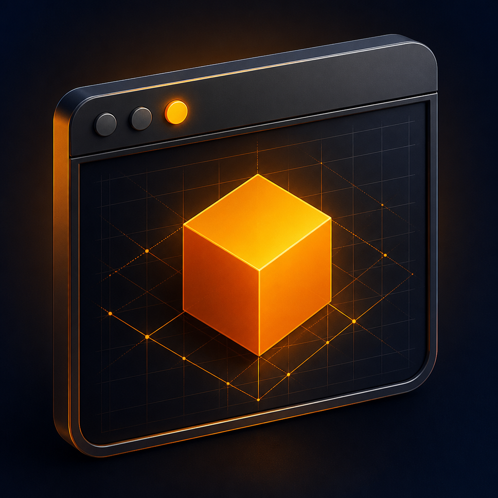

# WEBbrAWSer

<p align="center">
  
</p>

AWSマネジメントコンソール専用Webブラウザ。

## 開発・ビルド

macOS 向け Electron アプリです。Node.js 22 以上が必要です。

```sh
npm install
```

開発中は次で起動します。

```sh
npm run dev
```

テストと型チェック:

```sh
npm test
npm run typecheck:node
npm run typecheck:web
```

配布用パッケージ:

```sh
pnpm run package        # .app + dmg + zip（arm64 / x64）
pnpm run package:dir    # Apple Silicon 向け .app のみ（検証用）
```

検証用アプリは `dist/mac-arm64/WEBbrAWSer.app`。署名・公証・自動更新の詳細は [docs/distribution.md](docs/distribution.md) を参照してください。

## セキュリティ上の注意（TOTP）

このアプリは **第1要素（コンソールを開く手段）と第2要素（TOTP シード）を同一プロセスに同居** させます。アプリまたはユーザーディレクトリが侵害された時点で、MFA は防御として機能しません。

- **ルートアカウントおよびブレークグラス用のシードは登録しない。** 別デバイスまたは 1Password 等に残す。
- シードは `safeStorage`（macOS では Keychain 由来の鍵）で暗号化し `totp.enc` に保存する。平文ではディスクに書かない。
- 起動後の初回参照で Touch ID による解錠を要求する。スリープ復帰後は再ロックする。
- Touch ID が使えない環境では、確認ダイアログによる解錠にフォールバックする（Keychain 暗号化は維持する）。
- コードをクリップボードへコピーした場合、30秒後に同じ内容であればクリアする。

## 配布

バージョンは SemVer。パッケージと署名の詳細は [docs/distribution.md](docs/distribution.md)、Slack 等からの URL 受け取りは [docs/finicky-integration.md](docs/finicky-integration.md)。
